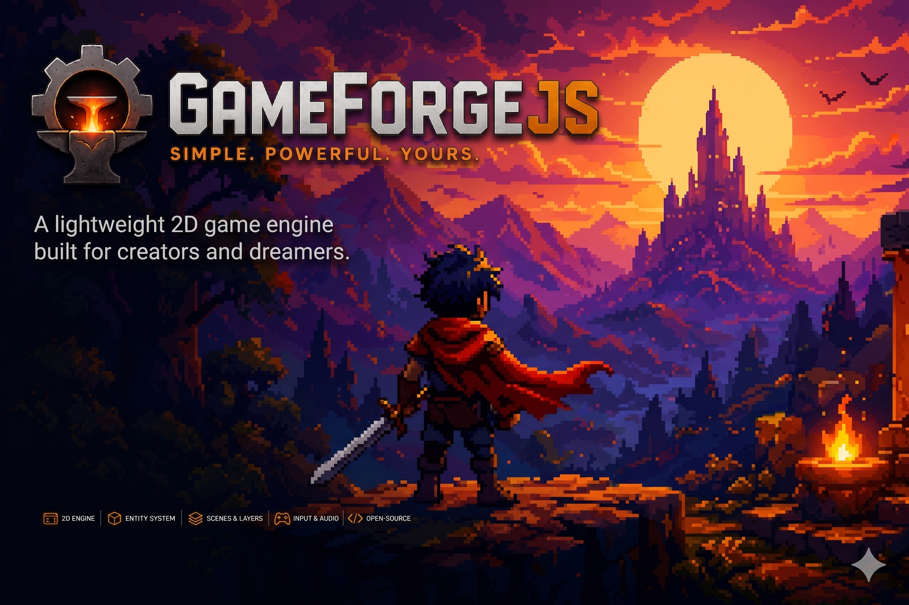

<p align="center">
  
</p>

# GameForgeJS

GameForgeJS e uma engine/framework experimental em JavaScript puro para jogos de navegador. O objetivo e permitir criar demos, jogos 2D/3D e ferramentas sem prender o runtime a dependencias externas.

O Node.js e opcional: ele entra apenas como servidor local de desenvolvimento para evitar CORS ao carregar JSON, imagens, audio, shaders e modelos.

## Principios

- Runtime independente, baseado em JavaScript nativo e APIs do navegador.
- Cada jogo/demo tem sua propria configuracao de janela, tela e comandos.
- Assets e fases devem caminhar para manifests data-driven.
- A engine deve aceitar heranca classica e evoluir gradualmente para componentizacao.
- Ferramentas como o WorldEditor devem ficar fora das demos, para servir qualquer projeto.

## Como Rodar

```sh
npm run start
```

Depois abra:

```txt
http://localhost:8080/Main.html
```

Sem query string, `Main.html` abre o Admin Mode, uma tela para escolher qual demo ou ferramenta rodar.

Links diretos continuam funcionando:

```txt
http://localhost:8080/Main.html?demo=advanced
http://localhost:8080/Main.html?demo=tactical
http://localhost:8080/Main.html?demo=fighting2d
http://localhost:8080/Main.html?demo=adventure2d
http://localhost:8080/Main.html?demo=demo3d
http://localhost:8080/Main.html?demo=solar3d
http://localhost:8080/Main.html?demo=mini3d
http://localhost:8080/Main.html?demo=online
http://localhost:8080/Main.html?demo=immature
```

## Demos

| Demo | Entrada | Config | Descricao |
| --- | --- | --- | --- |
| Advanced | `Demos/DemoAdvanced/mainAdvanced.js` | `Demos/DemoAdvanced/advanced.config.json` | Plataforma/RPG 2D com manifests, fases, inventario, skill tree, hitboxes e HUD. |
| Tactical RPG | `Demos/DemoTacticalRPG/mainTacticalRPG.js` | `Demos/DemoTacticalRPG/tactical.config.json` | Grid tatico com AStar, area de movimento, acao e batalha. |
| Fighting 2D | `Demos/DemoFightingGame2D/mainFightingGame2D.js` | `Demos/DemoFightingGame2D/fighting.config.json` | Menu, arcade, versus, selecao de personagem, teclado e gamepad configuravel. |
| Adventure 2D | `Demos/DemoAdventure2D/mainAdventure2D.js` | `Demos/DemoAdventure2D/adventure.config.json` | Top-down adventure componentizado com transicao de camera entre salas. |
| Demo 3D | `Demos/Demo3D/mainDemo3D.js` | `Demos/Demo3D/demo3d.config.json` | Validacao da camada Render3D com WebGL2, luz, normal map e sombra. |
| Sistema Solar 3D | `Demos/DemoSolarSystem/mainSolarSystem.js` | `Demos/DemoSolarSystem/solar.config.json` | Demo Render3D com shader procedural de planetas, luz solar e orbitas. |
| MiniGame 3D | `Demos/DemoMiniGame3D/mainMiniGame3D.js` | `Demos/DemoMiniGame3D/mini3d.config.json` | Sky Trail com plataformas moveis/temporizadas, moedas, bandeira final, skybox, fisica e gamepad. |
| Online MMO | `Demos/DemoOnlineMMO/mainOnlineMMO.js` | `Demos/DemoOnlineMMO/online.config.json` | Sandbox 2D online com chat canvas, mapa proprio e sala local entre abas via adaptador substituivel. |
| Immature | `Demos/Demo/mainImmature.js` | `Demos/Demo/immature.config.json` | Exemplo simples de movimentacao e colisao. |

## Estrutura

```txt
GameForgeJS/
  CoreCross/             Bootstrap, loop, config, assets, audio, input, math, componentes e pathfinding compartilhados
  Core2D/                Canvas 2D, GameObject, camera, cena, UI, colisao, combate, particulas e efeitos 2D
  Core3D/                WebGL/Render3D, Level3D, modelos, shaders, janela, objetos e fisica 3D
  CoreNetwork/           Rede e online reutilizaveis: GameNetwork, adaptadores, chat e sincronizacao
  docs/                  Guias tecnicos
  Demos/                 Todas as demos jogaveis e tecnicas
    DemoAdvanced/        Demo plataforma/RPG data-driven
    DemoFightingGame2D/  Demo de luta 2D
    DemoAdventure2D/     Demo top-down adventure componentizada
    DemoTacticalRPG/     Demo tatico
    Demo3D/              Demo WebGL
    DemoSolarSystem/     Demo de sistema solar em Render3D
    DemoMiniGame3D/      Mini game 3D
    DemoOnlineMMO/       Sandbox online 2D via CoreNetwork
```

## Criando Um Projeto

Um projeto novo deve ter entrada propria, config proprio e, quando houver assets, um `resources.json`.

```txt
MyGame/
  mygame.config.json
  resources.json
  mainMyGame.js
  Levels/
    FirstLevel.js
  Entities/
    Player.js
  Assets/
```

Entrada minima:

```js
import { BootstrapGame } from "../CoreCross/index.js";
import { FirstLevel } from "./Levels/FirstLevel.js";

BootstrapGame({
    configPath: ["gameforge.config.json", "MyGame/mygame.config.json"],
    manifestPath: "MyGame/resources.json",
    levels: [
        new FirstLevel(),
    ],
});
```

`gameforge.config.json` guarda apenas defaults da engine. O arquivo `MyGame/mygame.config.json` substitui os detalhes do jogo: titulo, tamanho de tela, audio, comandos e configuracoes especificas.

Para fazer o canvas do jogo ocupar toda a janela de forma responsiva, configure `"fullScreen": true` dentro de `screen`. A resolucao logica continua definida por `width` e `height`, preservando as coordenadas do jogo e da UI.

Exemplo de comando por jogo:

```json
{
  "input": {
    "gamepadProfile": "xbox",
    "actionMappings": {
      "ATTACK": [
        { "device": "keyboard", "input": "KeyZ" },
        { "device": "gamepad", "input": "X" }
      ],
      "RIGHT": [
        { "device": "keyboard", "input": "ArrowRight" },
        { "device": "gamepad", "input": "LEFT_STICK_RIGHT" },
        { "device": "gamepad", "input": "DPAD_RIGHT" }
      ]
    }
  }
}
```

## Assets E Manifests

Assets sao carregados por `ResourceManifestLoader`:

```json
{
  "images": [
    { "name": "player_idle", "path": "MyGame/Assets/Player/IDLE.png" }
  ],
  "audios": [
    { "name": "jump", "path": "MyGame/Assets/Audio/Jump.wav" }
  ],
  "jsons": [
    { "name": "first_level", "path": "MyGame/Assets/Manifests/first.level.json" }
  ]
}
```

No AdvancedDemo, fases sao compostas por manifests menores. Configuracoes comuns ficam em:

```txt
Demos/DemoAdvanced/Assets/Manifests/advanced/stage-default.json
```

E a fase compoe defaults + partes especificas:

```json
{
  "id": "advanced_snow_demo",
  "compose": [
    "advanced_stage_default",
    "advanced_core",
    "advanced_stage",
    "advanced_player",
    "advanced_enemies",
    "advanced_effects",
    "advanced_ui"
  ]
}
```

## Componentizacao

`GameObject` ainda aceita o fluxo classico com `OnStart`, `OnUpdate`, `OnFixedUpdate`, `OnDrawn` e `OnGUI`, mas agora tambem pode receber componentes reutilizaveis.

```js
import { GameObject } from "./Core2D/index.js";
import { BoundsComponent, HealthComponent, TransformComponent } from "./CoreCross/index.js";

const entity = new GameObject();
entity.AddComponent(new TransformComponent({ x: 80, y: 120 }));
entity.AddComponent(new BoundsComponent({ width: 32, height: 32 }));
entity.AddComponent(new HealthComponent({ hp: 100 }));
```

Veja o guia completo em [Componentizacao](Docs/components.md). Esse e o caminho para evoluir para um modelo ECS-lite sem quebrar as demos atuais.

## WorldEditor

O WorldEditor/WorldMaker agora e ferramenta externa ao runtime:

```txt
C:\Projects\GameForgeJsEditor
```

Para rodar:

```sh
cd C:\Projects\GameForgeJsEditor
npm run dev
```

O editor desktop pode abrir qualquer pasta, detectar configuracoes existentes ou criar uma estrutura nova. `gameforge.editor.json` e apenas opcional.

## Documentacao

- [Criando um projeto](Docs/new-project.md)
- [Configuracao de input por jogo](Docs/input-config.md)
- [CoreNetwork](Docs/network.md)
- [Cola de gamepad](GAMEPAD_COLA.md)
- [Componentizacao](Docs/components.md)
- [Render3D](Docs/render3d.md)
- [Advanced Stage Manifest](Docs/advanced-stage-manifest.md)
- [Hitbox Manifest 2D](Docs/hitbox-manifest.md)
- [WorldEditor v4](Docs/world-editor-v4.md)

## Direcao Do Projeto

O caminho mais forte agora e:

- consolidar `GameObject + Component`
- criar sistemas reutilizaveis para render, fisica, input e animacao
- transformar entidades em dados serializaveis
- manter ferramentas de autoria separadas do runtime
- finalizar um jogo pequeno usando a engine como validacao real
